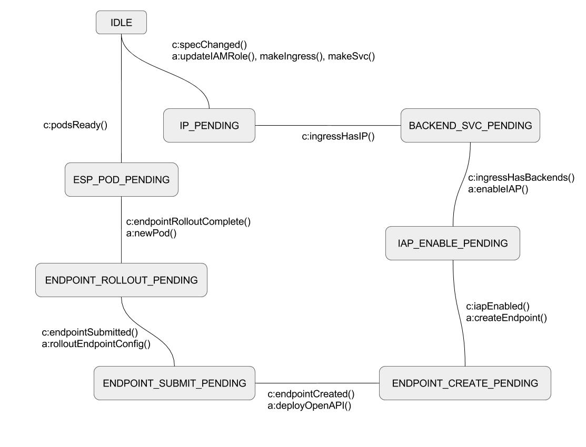

# IAP Ingress Controller

## THIS IS NOT AN OFFICIAL GOOGLE PRODUCT

## Intro

Controller for a Custom Resource Definition (CRD) that mimics the Ingress spec with support for the Identity-Aware Proxy (IAP).

This controller does the following:

1. Updates project IAM policy to grant members access to IAP.
2. Creates a new `Ingress` resource.
3. Enables IAP on the backend services.
4. Creates a [Cloud Endpoints service and DNS record](https://cloud.google.com/endpoints/docs/openapi/naming-your-api-service) in the form of `SERVICE.endpoints.PROJECT_ID.cloud.goog`.
5. Deploys a wildcard OpenAPI spec to the Cloud Endpoints service configured for the IAP-enabled backend service.
6. Creates a new `Service` and `Pod` postfixed with `-esp` for the [Extensible Service Proxy](https://github.com/cloudendpoints/esp/blob/master/doc/k8s/README.md) used to verify signed IAP headers in requests.
  a. The backend services route traffic to the ESP `NodePort` service.
  b. The ESP pod has a `readinessProbe` configured to verify that `https://HOSTNAME/_gcp_iap/identity` is responding before registering as a valid endpoint to prevent accidentally exposing your service before IAP is enabled.

See the chart [README.md](./charts/iapingress-controller/README.md) for details.

## State Machine

</img>